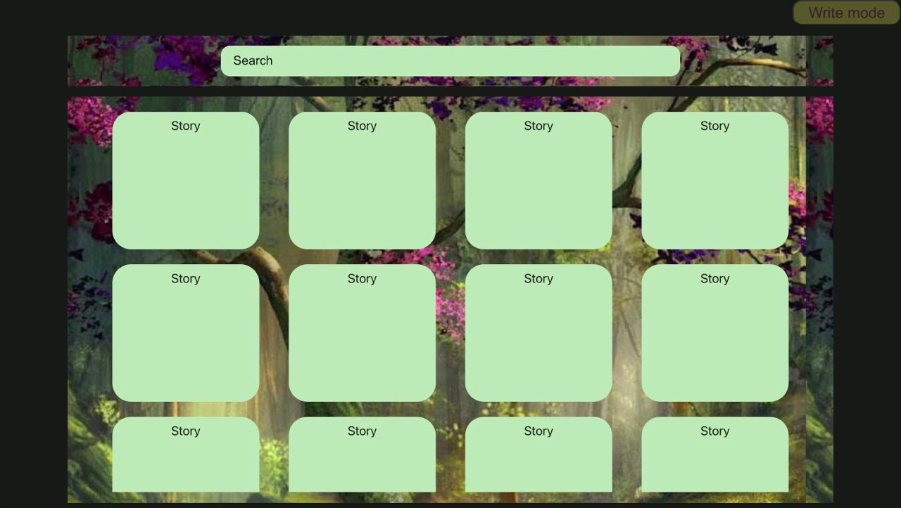
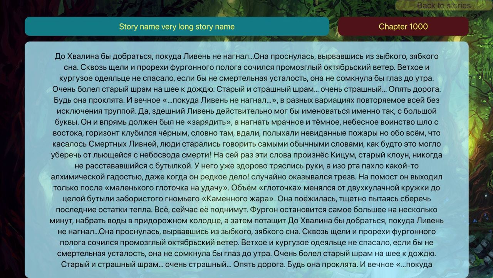
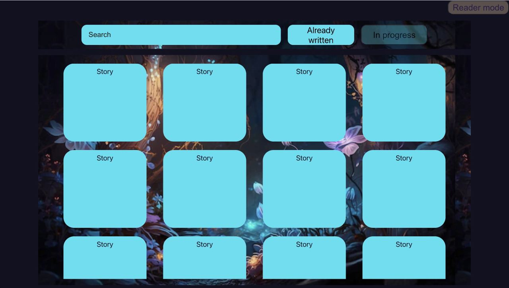
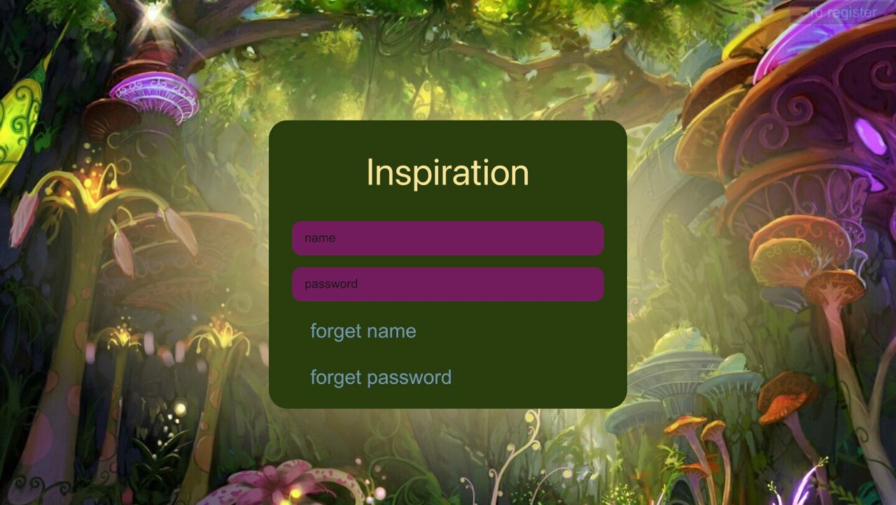
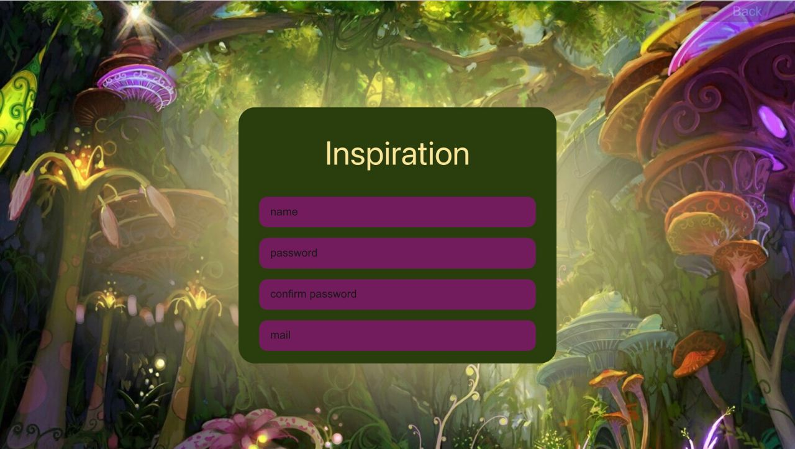
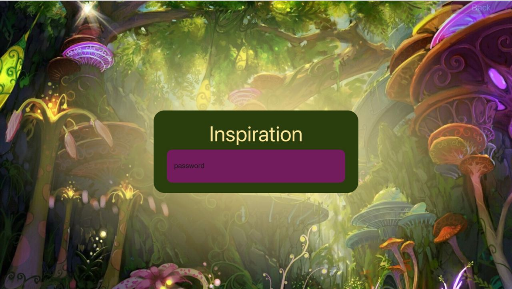
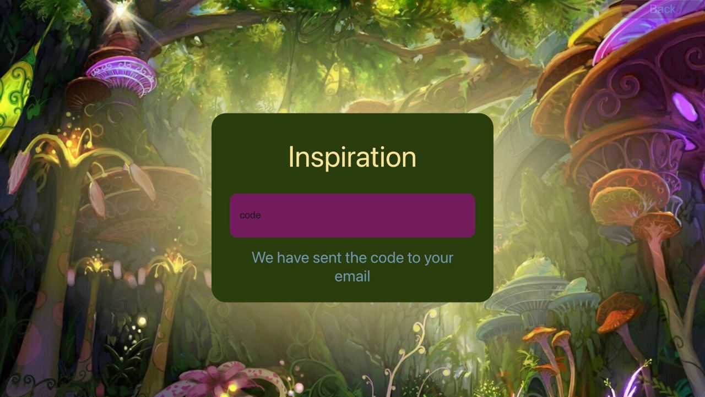
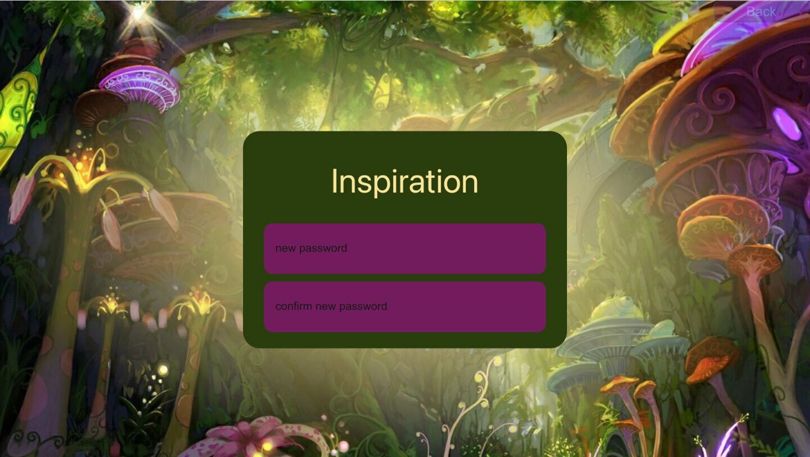
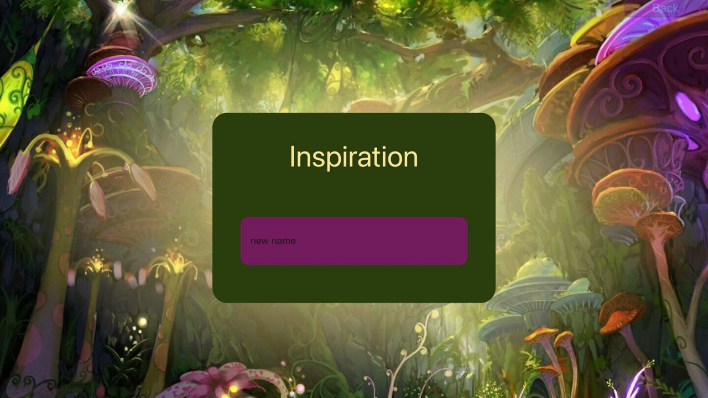

# Inspiration
Сайт для писателей и читателей фентези.
Функционал:

    искать рассказы
    читать рассказы
    писать эпизоды
    объединять эпизоды в главу
    устанавливать картинку фона для эпизода

Основная главная страница, на которую можно попасть без регистрации, это **main-reader-page**.  
На ней вываливаются рекомендуемые истории (пока планируется, что будут вываливаться просто все подряд),  
есть поиск по названиям (возможно будет сложнее, если хватит времени).

## Функционал

все **inputs** умеют обрабатывать **Enter** и сохранять значение поля, используя **useState** и **key**
**TODO**: не умеет переключать состояние в зависимости от нажатия **Enter** (например переключать страницу)

### main-reader-page  

**Плашки с названием историй Story**   
Есть scroll поля с плашками.
При нажатии на плашку с нужной историей пользователь поподает на страницу чтения рассказа **read-page**.

**Кнопка Writer mode**  
Кнопка становится не прозрачной при наведении курсора на неё.  
Если ты зарегестрированный пользователь (проверки пока нет, это будет в бэке), то по кнопке **Write mode**  
можно попасть на главную страницу писателя **main-writer-page**.

**Поиск по историям Search**

добавлен

### read-page
(можно считать законченным)

**Кнопка Back to stories**  
Кнопка становится не прозрачной при наведении курсора на неё.  
При нажатии на неё пользователь возвращается обратно на **main-reader-page**.

**Плашка с названием истории StoryName**

**Плашка с номером главы ChapterNum**  

**Плашка с текстом истории ReadPanel**  
Есть scroll текста

### main-writer-page
(в доработке)

**Кнопка Reader mode**  
Кнопка становится не прозрачной при наведении курсора на неё.  
При нажатии на неё пользователь поподает на главную страницу читателя **main-reader-page**.

**Плашки с названием историй Story**   
Есть scroll поля с плашками.
При нажатии на плашку с нужной историей пользователь поподает на страницу написания рассказа **write-page**.

**Есть два режима: уже написаннные истории и истории, которые ещё не окончены**

### write-page

**Кнопка Back to stories**  
Кнопка становится не прозрачной при наведении курсора на неё.  
При нажатии на неё пользователь возвращается обратно на **main-writer-page**.

**Плашка с названием истории StoryName**

**Плашка с номером главы ChapterNum**

**Плашка с номером эпизода Episode**

**Кнопка загрузки картинки LoadPicture**

**Плашка = поле для ввода текста истории**  

### authorization logic

**Общая логика:**

    Authorization ---**To register**---> Registration ---**Back**---> Authorization

                                         Registration ---зарегался---> Authorization

    Authorization ---**forgot name**---> Password ---**Back**---> Authorization
                                         Password ---**ввёл**---> GetCode ---**Back**---> Password
                                                                  GetCode ---ввёл---> SetNewName ---**Back**---> GetCode
                                                                                      SetNewName ---ввёл---> Authorization
    
    Authorization ---**forgot password**---> Name ---**Back**---> Authorization
                                             Name ---**ввёл**---> GetCode ---**Back**---> Name
                                                                  GetCode ---ввёл---> SetNewPassword ---**Back**---> GetCode
                                                                                      SetNewPassword ---ввёл---> Authorization

    
    Authorization ---ввёл все поля---> WriterPage

**TODO**: переключать страницы по нажатию **Enter**

### authorization-page

### registration-page

### name-restoration-page

### password-restoration-page

### code-page

### new-password-page

### new-name-page

